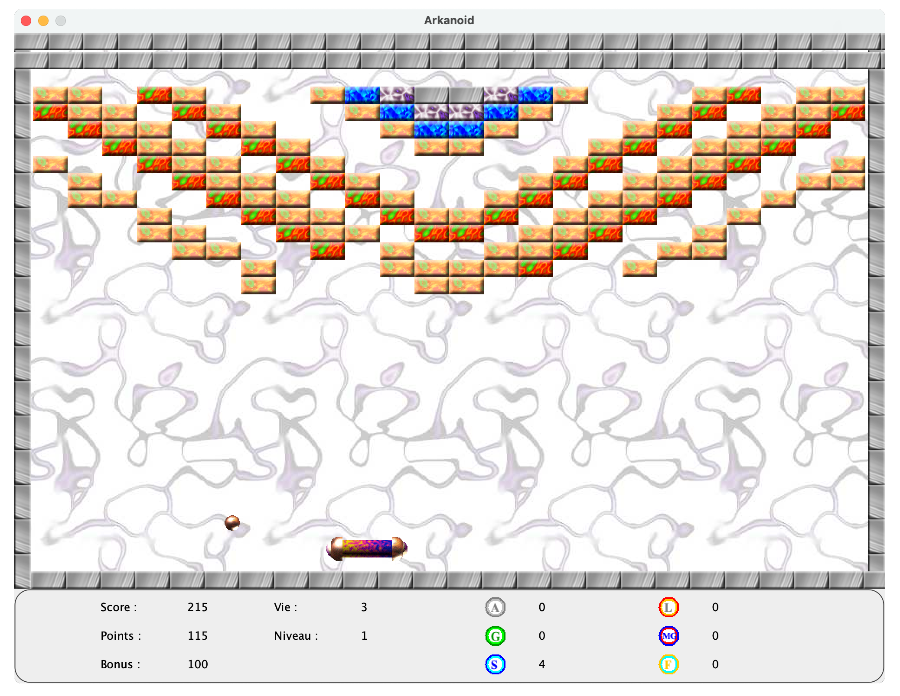
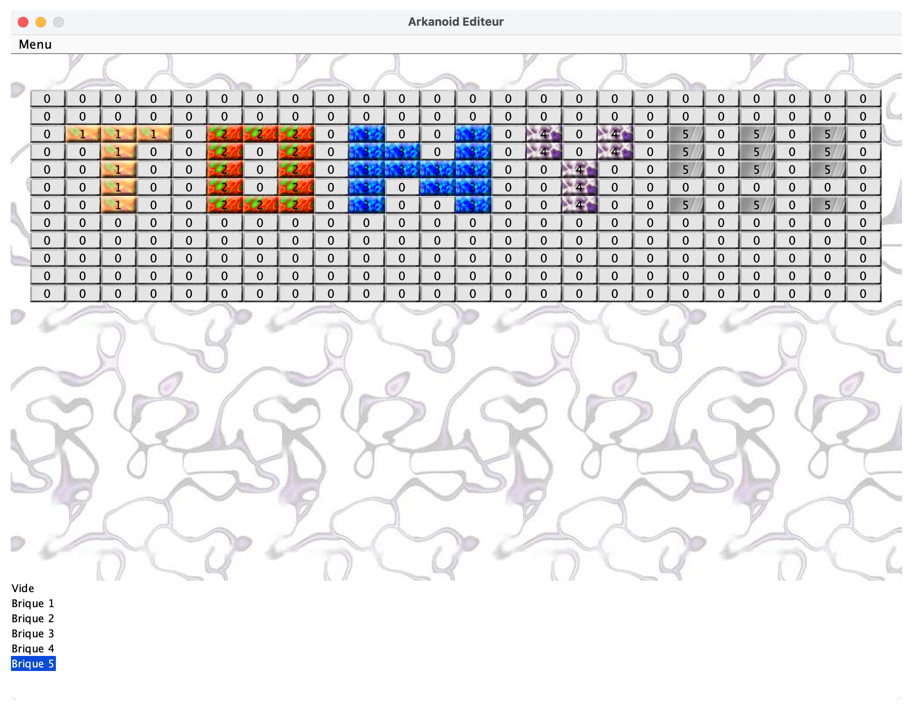

<h1 align="center"><a href="https://github.com/anthonyliot/arkanoid/releases/tag/v1.0">SHISENSHO</a></h1>

<strong>Japanese tile-based game in java</strong>
 2007

 
<h2>About</h2>
This project was developed during my bachelor degree in Caen, France. 
 
Arkanoid is a block breaker arcade game. Controlling a paddle-like craft known as the Vaus, the player is tasked with clearing a formation of colorful blocks by deflecting a ball towards it without letting the ball leave the bottom edge of the playfield. Some blocks contain power-ups that have various effects, such as increasing the length of the Vaus, creating several additional balls, or equipping the Vaus with cannons. Other blocks may be indestructible or require multiple hits to break.
 
You can download the JAR file and try it <a href="https://github.com/anthonyliot/arkanoid/releases/tag/v1.0">here</a>

<h2>Installation</h2>

1. Download this project as zip and extract it
2. Download <a href="https://netbeans.apache.org">Apache Netbeans</a>
3. Import the project and choose build and run.

<h2>Copyright</h2>
This project is licensed under the terms of the MIT license. See <a href="LICENSE">license</a>.